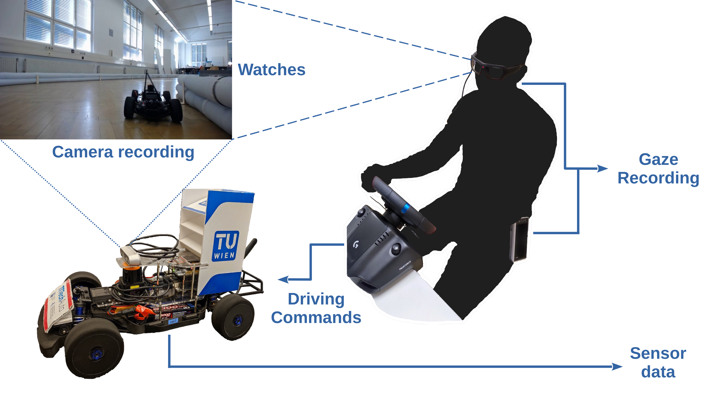

# Learning Human Attention
This is the repository of the work "Enhancing Robot Learning through Learned Human-Attention Feature Maps".

We provide instruction to work with the experimental data recorded in
driving tasks with F1TENTH miniature vehicles.



# Download the raw dataset
The recorded data are freely available on [Zenodo](https://doi.org/10.5281/zenodo.7897588).

The downloads on Zenodo are different runs on the same track: [Getreidemarkt](https://www.tuwien.at/tu-wien/organisation/zentrale-bereiche/gebaeude-und-technik/veranstaltungsservice-und-lehrraumsupport/raumdatenbank/hoersaele/gm-8-9)
They are uploaded in different `.zip` files for a better download-coordination.
Each of the `.zip` files represents a single run, where each of the runs contains the following files:
- A `.bag` file that contains all the ROS-messages recorded on the car during driving on the track.
- A `.cal` file that contains the calibration information of the user that was wearing the [VPS](https://viewpointsystem.com/en/) glasses for the run
- A `.tsv` file that contains all human attention gaze points for a specific frame
- Two video files (`.mkv` and `.mp4`) recorded via webcam on the car during driving on the track
- `.yaml` file containing the information of valid sections of the run (necessary for the pipeline processing described below)


# Preprocess the data

To process the raw data and map the focus points from the eye-tracking systems
into the view from the on-board camera, we perform a coordinate projection.

To reproduce the preprocessing, we provide the following docker image `cyberwyrm/eye-tracking_pipeline`.


### Instructions

1. Pull the docker image from Dockerhub
```
docker pull cyberwyrm/eye-tracking_pipeline:latest
```

2. Run the container from the folder containing the dataset (_see instructions above to download the data_)
```
docker run -v <path-to-dataset-folder>:/raw_data/dataset --name eye-tracking_pipeline cyberwyrm/eye-tracking_pipeline:latest
```

where `<path-to-dataset-folder>` is the absolute path on the host file system where the raw data are located. 

### Output description

The output of the processing pipeline is produced and stored for each run in the relative folder. 
The output consists of:
- `marked_frames/`: contains all frame images,
- `transformed_coords.csv`: contains the focus points for each frame.

# Citation
If you find this work useful for your own ideas, please cite our paper:

```
@online{scheuchenstuhl2023enhancing,
    title={Enhancing Robot Learning through Learned Human-Attention Feature Maps}, 
    author={Daniel Scheuchenstuhl and Stefan Ulmer and Felix Resch and Luigi Berducci and Radu Grosu},
    booktitle = {Workshop on effective Representations, Abstractions, and Priors for Robot Learning (ICRA 2023)},
    year={2023}
}
```

